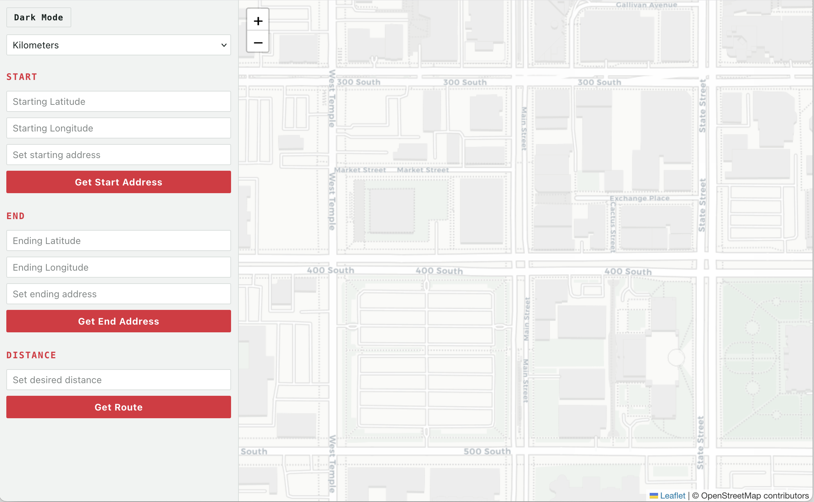
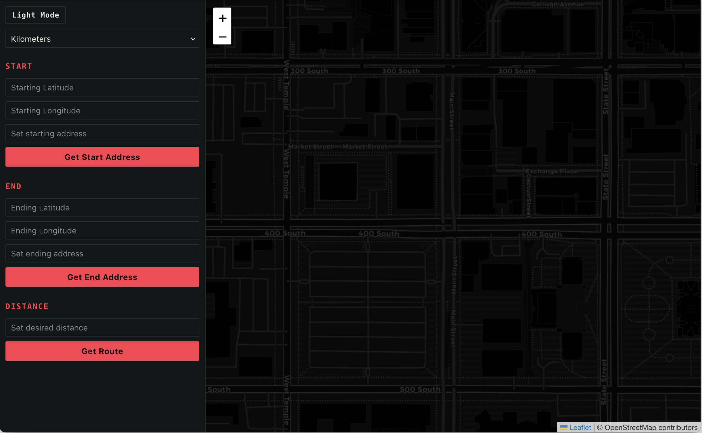

# runThisDistance

A route planner that generates a walking/running/biking route between two points matching a target distance you choose.

Enter a start point, end point, and desired distance (by typing coordinates, searching an address, or clicking directly on the map), and the app computes a route that lands close to that target, rendered live on an interactive map.


## The Issue

Routing APIs, such as [OSRM](https://project-osrm.org/), return the shortest path between two points. Hitting a target distance meant building that logic from scratch:

1. **Geometry** - using the insight that all points where `distance(start to waypoint) + distance(waypoint to end)` equals a constant form an ellipse (with start/end as foci), the app calculates how far off the direct path a waypoint needs to sit to add the desired extra distance.
2. **Spherical trigonometry** - since lat/lon coordinates sit on a sphere, not a flat plane, the app implements the Haversine formula (great-circle distance), initial bearing, and the destination-point formula by hand, in Python, based on the reference formulas at [movable-type.co.uk](https://www.movable-type.co.uk/scripts/latlong.html).
3. **Convergence loop** - straight-line geometry can only approximate what real, winding roads will actually produce. The backend requests a route through the calculated waypoint, checks the actual returned distance against the target, and scales the waypoint offset closer with each pass (up to 8 attempts) until the result lands within 3% of the target.
4. **Two route options** - the waypoint can sit on either side of the direct path between start and end. The backend runs the full convergence loop independently for each side, returning two distinct routes at roughly the same target distance for the user to compare and choose between.

## Features

- Click on map to set start/end points, or search by address (geocoding via [Nominatim](https://nominatim.org/))
- Two route options per search, shown simultaneously on the map in distinct colors, with a card-based picker to select one
- Turn-by-turn directions for the selected route, built from OSRM's step data
- Kilometers/miles toggle, applied consistently to input, display, and directions
- Live map rendering ([Leaflet](https://leafletjs.com/) via [react-leaflet](https://react-leaflet.js.org/)) with auto-recentering to fit the generated route(s)
- Light/dark theme toggle, built on CSS custom properties, including matching light/dark basemap tiles from [CartoDB](https://carto.com/basemaps)
- Input validation and clear error messaging (impossible targets, unreachable points, rate limits, etc.)
- Rate-limited backend endpoints to stay within third-party API usage policies

 

## Tech stack

**Frontend:** React, [react-leaflet](https://react-leaflet.js.org/) (map rendering)
**Backend:** Python, Flask, Flask-CORS, Flask-Limiter
**External APIs:** [OSRM](https://project-osrm.org/) (routing), [Nominatim](https://nominatim.org/) (geocoding), [CartoDB basemaps](https://carto.com/basemaps) (light/dark map tiles)
**Core algorithms:** Haversine distance, bearing/azimuth calculation, destination-point projection. All implemented from the underlying spherical trigonometry from [movable-type](https://www.movable-type.co.uk/scripts/latlong.html), in `backend/equations.py`

## Running it locally

**Backend:**
```bash
cd backend
pipenv install
pipenv shell
python app.py
```
Server runs on `http://127.0.0.1:5555`.

> Requires pipenv (`pip install pipenv` if you don't have it). Dependencies are locked in `Pipfile.lock`.

**Frontend:**
```bash
cd frontend
npm install
npm start
```
App runs on `http://localhost:3000`.

## Project structure

```
backend/
  app.py          # Flask routes, request handling, validation, dual-route convergence logic
  equations.py    # Haversine, midpoint, bearing, and waypoint-projection math
  test.py         # scratch script used to verify the geometry functions during development
  Pipfile         # dependencies
  Pipfile.lock    # locked dependency versions
frontend/
  src/App.js      # Map, form inputs, click-to-set handlers, route selection, directions, theming, API calls
  src/App.css     # Layout and theme (CSS custom properties)
```

## Possible future improvements

- Persist favorite/past routes (would introduce a database)
- Geolocation-based initial map centering
- Replace `test.py` (a manual scratch script) with a real automated test suite (`pytest`)
- Deploy publicly (frontend on Netlify/Vercel, backend on Render)